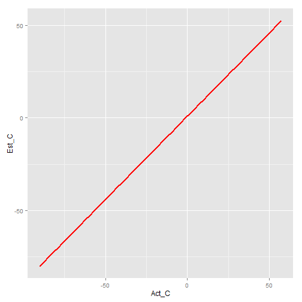

## Overview
Temperature conversion from Fahrenheit to Celsius can be difficult to do without a calculator.  The shiny application demonstrates a simpler method that can be done "in your head".

## Details and Formulas
Numerically accurate conversion formula is $C = (F-32) * 5 / 9$
A simpler method that could be done easily in your head is $C = (F-30) / 2$
For a given Fahrenheit temperature of 72 Deg F, the R code is:

```r
(72 - 32) * 5 / 9
```

```
## [1] 22.22222
```

```r
(72 - 30) / 2
```

```
## [1] 21
```

--- .class #id 
## Plot of surface temperatures using both methods
Here is a plot of Fahrenheit temperatures from -130 to 135 using the two formulas.
 

--- &radio  
## Interactive Quiz

What is the Celsius temperature Estimate for 80 Degres Fahrenheit?

1. 15
2. 20
3. _25_
4. 30
5. 35

*** .hint

Take the Fahrenheit temperature, subtract 30
then, take that result and divide by 2.

*** .explanation

C = (F - 32) * 5 / 9
Est C = (F - 30) / 2

--- .class #id 
## Summary
As demonstrated, you can easily estimate Celsius temperature when given Fahrenheit temperature by subtracting 30, and then dividing the result by 2.

This yeilds comperable results to the numerically correct formula.

For interactive demo, go to https://smithk165.shinyapps.io/DevDataProducts_Shiny
